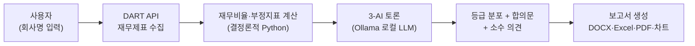
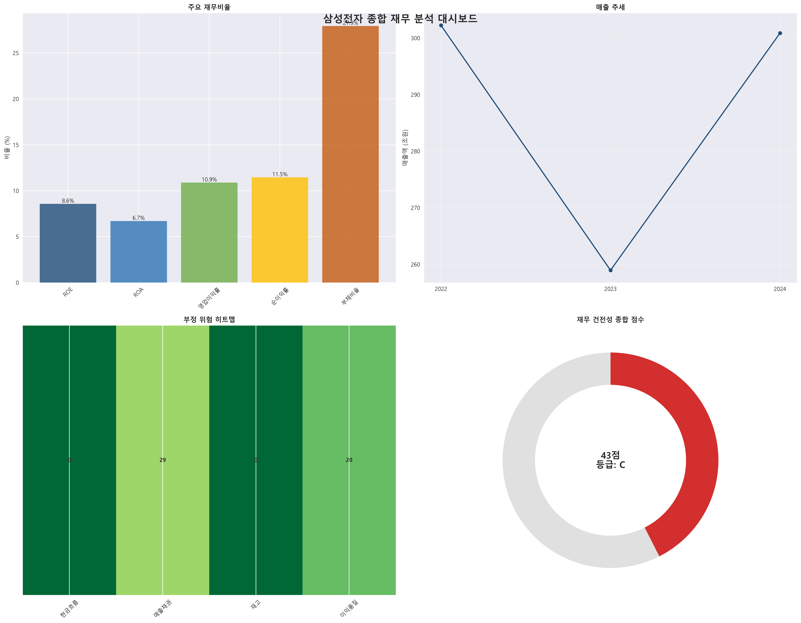

# AI 회계 분석 시스템 (A2A Accounting Agent)

[](https://github.com/leaf446/ai-accounting-agent/actions/workflows/ci.yml)

> **오픈소스 LLM 3개가 토론하고, 판단의 불확실성까지 보여주는 재무 분석 도구**
> 금감원 DART 공시 데이터를 수집해 로컬 LLM(Ollama) 3개가 협업 분석하고,
> 회계 전문가가 검토할 수 있는 보고서를 생성합니다. 모든 AI 추론은 로컬에서 실행됩니다.

## 핵심 철학: 확정이 아니라 판단 보조

이 도구는 등급을 "확정"하지 않습니다. AI 판정이 얼마나 한쪽으로 모였는지(분포)와
소수 의견의 근거를 함께 보여줘서, **최종 판단은 회계 전문가가 내리도록** 설계했습니다.

실제 측정 예시 (삼성전자 2024 사업보고서, 실행 결과의 판정 분포):

```
📊 투자등급: B   — 판정 분포: B 6표 · C 2표       (확신도 80%, 강한 합의)
📊 부정위험: B   — 판정 분포: B 2표 · C 1표 · D 1표 (확신도 70%, 판단 갈림!)
```

투자등급은 AI 3개가 강하게 합의했지만, 부정위험은 의견이 갈렸습니다 —
이 "갈림" 자체가 사람이 들여다봐야 할 지점이라는 신호입니다. 최종 합의문에는
다수 의견의 근거와 함께, 어떤 요소를 중시하면 다른 등급이 가능한지
'소수 의견 고려사항'이 서술됩니다.

## 동작 원리



**설계 원칙 1 — 계산과 판단의 분리**: ROE·부채비율 같은 숫자는 전부 결정론적
파이썬 코드가 계산하고, LLM은 그 숫자의 *해석*만 담당합니다. LLM 환각이
수치를 오염시킬 수 없는 구조입니다.

**설계 원칙 2 — 서로 다른 모델로 관점 다양성 확보**: 같은 모델에 페르소나만
바꾸면 비슷한 결론으로 수렴하기 쉽습니다. 학습 데이터가 다른 3개 모델을 써서
실제로 다른 관점이 토론에 등장하게 했습니다.

| 에이전트 | 모델 | 역할 |
|---|---|---|
| 김성실 (총괄조정관) | llama3.1:8b | 의견 조율, 최종 합의문 작성 |
| 이정확 (재무분석가) | qwen3:8b | 재무비율 해석 (사고 모드는 비활성화해 응답 지연 방지) |
| 박의심 (부정탐지전문가) | exaone3.5:7.8b | 부정위험 평가 — 감사의 '전문가적 의구심' 역할 |

> **모델 선정 기준**: 최신 세대일 것, 한국어 성능, 8GB VRAM에 4bit 양자화로 탑재
> 가능할 것(7~8B급), 서로 다른 계열일 것(오류 독립성). Solar 계열도 검토했으나
> 10.7B는 구세대, Pro(22B)는 VRAM 제약으로 제외.

**토론 구조 — 스냅샷 기반 라운드**: 매 라운드 시작 시점의 의견을 전원에게
동일하게 보여주고 각자 수정하게 합니다 (재무비율 2라운드, 부정위험 1라운드).
발언 순서에 따라 정보량이 달라지는 비대칭이 없고, 라운드를 거치며 서로의
수정 의견에 재반응하는 실질적 조율이 일어납니다.

**temperature 0.7 유지 결정**: 실행 간 등급 변동을 없애는 대신(재현성),
토론 과정의 의견 표본 9개에서 등급 분포를 집계해 변동성을 **불확실성 신호**로
활용합니다. 추가 LLM 호출 없이 분포를 얻는 설계입니다.

**동종업계 비교 — 하드코딩이 아닌 실통계**: 절대 수치만으로는 "삼성전자 부채비율
30%가 낮은가?"를 판단할 수 없으므로, **한국은행 「기업경영분석」 통계(ECOS API)**의
업종 평균과 비교합니다. DART 표준산업분류코드로 회사의 업종을 판별해 해당 업종의
실제 재무비율(부채비율·영업이익률)을 조회하고, 우량/열위를 판정합니다. 분기 통계의
변동을 완화하기 위해 최근 4개 분기 평균(TTM 근사)을 사용합니다.
임의로 넣은 벤치마크 값이 아니라 공식 통계를 실시간 조회한다는 점이 핵심입니다.
(예: 삼성전자 부채비율 29.9% vs 기계·전기·전자 업종 58.5% → 우량)

## 산출물

분석 완료 후 보고서 3종(DOCX 종합보고서 · Excel 상세표 · PDF)과
차트 5종(비율 비교, 다년도 추세, 부정위험 레이더, 재무구조, 종합 대시보드)이
생성됩니다.



## 설치 및 실행

**요구 사항**: Python 3.10+, [Ollama](https://ollama.com), DART API 키
([opendart.fss.or.kr](https://opendart.fss.or.kr) 무료 발급), 디스크 ~14GB(모델 3개)

```bash
# 1. 클론 및 의존성 설치
git clone https://github.com/leaf446/ai-accounting-agent.git
cd ai-accounting-agent
python -m venv .venv
# Windows: .venv\Scripts\activate | macOS/Linux: source .venv/bin/activate
pip install -r requirements.txt

# 2. 모델 다운로드 (각 4~5GB)
ollama pull llama3.1:8b
ollama pull qwen3:8b
ollama pull exaone3.5:7.8b

# 3. API 키 설정 (.env 파일 생성)
echo DART_API_KEY=발급받은키 > .env
# (선택) 동종업계 비교를 쓰려면 한국은행 ECOS 키 추가
echo ECOS_API_KEY=발급받은키 >> .env

# 4. 실행
python main_execution_file.py
```

GUI에서 "연결" 클릭 → 회사명 검색(예: 삼성전자) → AI 분석 시작.
`.env`에 키가 있으면 자동으로 입력됩니다.

## 프로젝트 구조

```
├── main_execution_file.py    # 진입점
├── main_gui_interface.py     # GUI (CustomTkinter)
├── core_agent_engine.py      # A2A 협업 엔진 (DART 수집·비율 계산·토론·합의)
├── conversation_handler.py   # 자연어 후속 질문 처리
├── document_generator.py     # DOCX/Excel/PDF 보고서 생성
└── visualization_engine.py   # 차트·대시보드 생성
```

## 한계와 개선 방향

- **분석 1건에 5~7분 소요** — 8GB GPU에는 7B 모델이 하나만 상주할 수 있어
  발언자가 바뀔 때마다 모델 교체(4~5GB 로드)가 일어납니다. VRAM이 충분한
  환경에서는 3개 모델 상주로 크게 단축됩니다. 초기 의견 수집 단계는
  구조적으로 병렬화 가능하지만 단일 GPU에서는 이득이 없어 순차 처리합니다.
- **LLM 등급 판정은 참고용** — 지표 계산은 결정론적이지만 해석·등급은
  LLM 판단이므로, 분포·소수 의견과 함께 전문가 검토를 전제로 합니다.
- **LLM 응답 품질 테스트의 한계** — 결정론적 로직(비율 계산, 등급 추출,
  분포 집계)은 단위 테스트로 검증하지만, LLM 토론의 내용 품질 자체는
  자동 테스트가 어려워 스모크 테스트와 수동 검증에 의존합니다.
- **동종업계 비교 범위** — 한국은행 기업경영분석은 금융보험업을 포함하지 않아
  금융사는 업종 비교가 제공되지 않으며, ROE는 통계에 없어 부채비율·영업이익률로
  비교합니다. 상장·비상장 혼재 업종 평균과 개별 상장사를 비교하는 한계가 있습니다.

## 최근 개선 이력 (2026-07)

1년 전 프로토타입을 재검토하며 다음을 개선했습니다 (커밋 이력 참조):

- **동종업계 비교 신규 구현**: 한국은행 기업경영분석(ECOS API) 업종 평균과 비교
  (하드코딩된 임의 벤치마크 → 공식 통계 실시간 조회)
- 모델 최신화: qwen2.5→**qwen3**(사고 모드 제어 포함), mistral→**EXAONE 3.5**(한국어 특화)
- 토론 라운드를 릴레이 방식 → **스냅샷 기반**으로 변경 (발언 순서 편향 제거)
- 부정위험 등급 스케일 명시 (A=위험 낮음 ~ D=위험 높음 — 해석 모호성 버그 수정)
- 하드코딩이던 확신도를 **판정 분포의 쏠림 비율**로 실계산
- 최종 합의문에 **소수 의견 고려사항** 서술 추가
- 미사용 가중치·장식 코드 제거, `.env` 키 자동 로드
